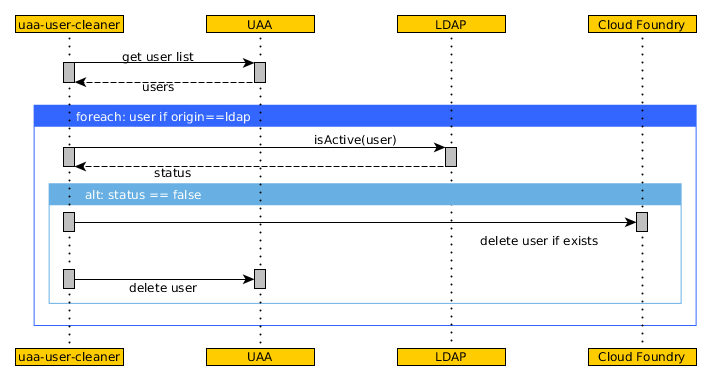

# Presentation

**uaa-user-cleaner** removes users from [UAA] and [Cloud Foundry] that are not active anymore in the underlying
[LDAP] server.

Every times a user logs in [Cloud Foundry] mapped to [LDAP] server, [UAA] server
connects [LDAP] to validate credentials and copies user's informations in its local database.

When this user is removed or deactivated from [LDAP], he can't login anymore but its data remains
in [UAA] and [Cloud Foundry]. This kinda pollutes any other tools that might use [UAA]'s user list.

# How it works

This tool starts as a webserver which runs an infinite loop that performs a user scan every configured
interval. The webserver provides the `/metrics` endpoint which output [prometheus] metrics.

The user scan procedure is quite straightforward:




# Configuration

**uaa-user-cleaner** requires the following configuration elements:
* `uaa`: a client with **scim.write** scope
* `cloud foundry`: a client with **cloud_controller.admin** scope
* `ldap`:
   * a user with **read** access
   * a search **query**. This query must only match *active* users. Any user in [UAA] that the
     search query won't match in [LDAP] will be considered as inactive and deleted from both [UAA]
     and [Cloud Foundry].

```yml
# target your local config file with: "CLOUD_FILE=config.yml ./uaa-user-cleaner"
---
services:
  - name: my-config
    tags: [ "config" ]
    credentials:
      # if true, inactive users are not deleted from uaa and cloud foundry
      dry_run: false

      # interval between user scans (given in golang duration format)
      interval: 12h

      ldap:
        # URL of the ldap sever. Use ldap:// scheme to deactivate TLS
        url: ldaps://ldap.example.com:389

        # DN used for authenticating to ldap server
        bind_user: uid=myuser,ou=Auth,dc=example,dc=com

        # Password used for authenticating to ldap server
        bind_password: myuser-password

        # if true, TLS connection will not be verified
        skip_ssl_validation: false

        # Query search base when searching for an active user
        search_base: dc=example,dc=com

        # Query filter used when searching for an active user
        # -> {0} is replaced by the uaa's username
        # -> can be arbitrary complex query that must match only active users
        # -> any users not found with this query will be considered as inactive and will
        # -> be deleted from uaa and cloud foundry
        valid_filter: (&(uid={0})(|(status=active)(!(objectClass=Person))))

      cf:
        # Cloud foundry API enpoint
        url: https://api.cf.example.com

        # client with cloud_controller.admin scope
        client_id: admin-client

        # corresponding client secret
        client_secret: admin-client-password

      uaa:
        # UAA token endpoint
        token_endpoint: https://uaa.cf.example.com/oauth/token

        # client with scim.write scope
        client_id: uaa-admin-client

        # corresponding client secret
        client_secret: uaa-admin-client-password

      log:
        # log level in PANIC, FATAL, ERROR, WARN, INFO, DEBUG
        level:  INFO

        # if true, json are outputted in json format
        json: false

        # if true, deactivates colors in log outputs
        no_color: false

      web:
        # web server listen interface and port, empty interface means all interfaces
        listen: ":26880"

        # path to SSL certificate, empty means simple http server
        SSLCert: ""

        # path to SSL key, empty means simple http server
        SSLKey: ""
```

# Monitoring

**uaa-user-cleaner** comes with a built-in [prometheus] exporter exposng the following metrics:


| Metric               | Type         | Description                                    | Dimensions |
| ------               | ---          | -----------                                    | ------     |
| uaa_cleaner_errors   | **Counter**  | Number of errors encountered on last user scan |            |
| uaa_cleaner_users    | **GaugeVec** | Number users reported on last user scan        | `origin`   |
| uaa_cleaner_duration | **Historam** | Duration of the user scan                      |            |


[UAA]: https://docs.cloudfoundry.org/concepts/architecture/uaa.html
[Cloud Foundry]: https://docs.cloudfoundry.org/
[LDAP]: https://docs.cloudfoundry.org/uaa/identity-providers.html
[prometheus]: https://prometheus.io/
<!-- Local Variables: -->
<!-- End: -->
